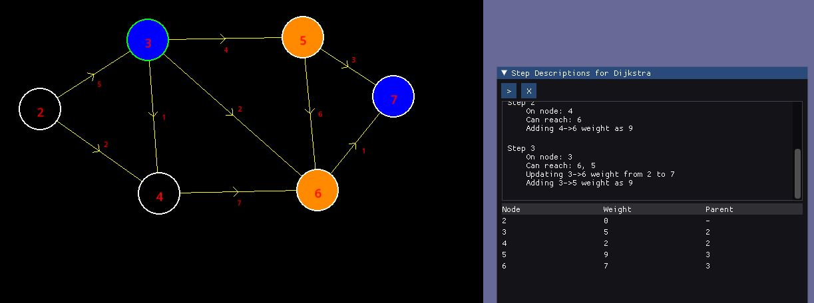

# Description
- This is a visualizer for Dijkstra's, BFS, and DFS graph algorithms
- Nodes are creatable, and singly and doubly linked connections are possible
- No edge weight can be negative - strictly positive

- Black nodes represent visited nodes
- Nodes with green borderes represent current node
- Orange nodes represent reachable nodes

# Running
- Store Makefile outside of the source directory where your SFML dlls and a directory with imgui files found within the make to create and link the imgui object files
- run make
- run ./dijk

# Controls
## Keybindings
| Control          | Description              |
|------------------|--------------------------|
|  Toggling "A" key | Located on the top left, toggling the key a will switch from adding Nodes or links|
|  Toggling "R" key | Located on the top left, toggling the key r will switch from removing Nodes or links|
|  Toggling "1"/"2" keys | Located on the top left, toggling between 1 and 2 will switch from singly linked links to doubly respectively (have to be in "Adding links" mode to use")

## Actions
| Control          | Description              |
|------------------|--------------------------|
| Creating nodes | Set to adding nodes with the "A" key and click anywhere. NOTE: nodes can't be very close to each other |
| Removing nodes | Set to removing nodes with the "R" key and click on a node. |
| Creating link  | Select the type of link you want with "1" or "2". Toggle adding links with the "A" key, and then drag from one node and drop on another. This will prompt for a weight |
| Removing link | Toggle removing link with the "R" key and drag from one node to another to delete the existing link |

